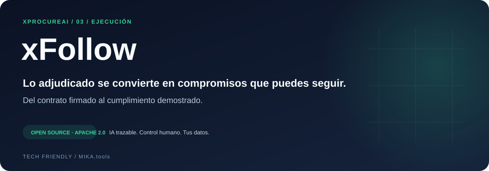

<p align="center"></p>

<p align="center">
  <a href="LICENSE"></a>
  <a href="https://github.com/techfriendly/xProcureAI"></a>
  <a href="docs/GETTING_STARTED.md"></a>
  <a href="CONTRIBUTING.md"></a>
</p>

# xFollow

## Lo adjudicado se convierte en compromisos que puedes seguir.

**Del contrato firmado al cumplimiento demostrado.**

El valor de una contratación se demuestra durante su ejecución. xFollow reúne obligaciones, hitos, evidencias, facturas y cambios en un mismo espacio para que el responsable del contrato sepa qué se espera, qué vence y qué está acreditado.

[Empezar](docs/GETTING_STARTED.md) · [Explorar xProcureAI](https://github.com/techfriendly/xProcureAI) · [Roadmap](ROADMAP.md) · [Contribuir](CONTRIBUTING.md)

## Lo que cambia en tu día a día

### Activa el contrato desde la adjudicación

Importa desde xTender, xReview o PCSP, o crea un contrato manualmente. El traspaso desde xReview conserva referencias y compromisos aceptados.

### Anticípate a los vencimientos

Obligaciones, hitos, garantías, prórrogas, alertas y tareas vinculadas a la vida del contrato.

### Comprueba con evidencias

Biblioteca documental con hashes y extracción de texto. Verificaciones asistidas y análisis de riesgos de la oferta adjudicataria con fuentes revisables.

### Conecta cumplimiento y economía

Registro y conformidad de facturas, pagos, cálculo de penalidades y resumen de liquidación a partir de los datos del contrato.

### Gestiona los cambios con control

Propuestas de modificación y prórroga, informes, validación y aplicación explícita. Expedientes de penalidad o resolución con cronología auditable.

### Cierra con toda la historia

Borradores de actas e informes, exportación DOCX y ZIP por contrato, más devolución completa del tenant con documentos y auditoría.

## Un recorrido pensado para trabajar

```text
Contrato → obligaciones validadas → alertas y tareas → evidencias → verificación → cambios o cierre
```

**Para quién:** Responsables de contrato, servicios gestores y equipos de supervisión que quieren convertir obligaciones dispersas en seguimiento operativo.

## Potencia de IA. Responsabilidad humana.

Las propuestas generadas conservan sus fuentes y pasan por revisión. Los cambios relevantes, validaciones y exportaciones dejan trazabilidad. Puedes adaptar el código, configurar tu infraestructura y elegir un servidor de modelos compatible con la API de chat de OpenAI.

**Estado del proyecto:** versión inicial en desarrollo activo. Las capacidades descritas están presentes en el código; su disponibilidad completa depende de la configuración de los servicios. Las decisiones administrativas corresponden a las personas autorizadas.

Necesita un PostgreSQL existente; el Compose no crea otra base de datos. Las evidencias subidas se guardan en el volumen local y el traspaso desde xReview puede enlazar objetos S3. El modo en memoria sirve para pruebas. Los trabajos de IA necesitan un modelo configurado.

## Empieza por tu propio entorno

```bash
git clone https://github.com/techfriendly/xFollow.git
cd xFollow
cp .env.local.example .env.local
```

Continúa con [la guía de instalación](docs/GETTING_STARTED.md): dependencias, credenciales, servicios y comandos de arranque. Puertos de referencia: **web `3101`**, **API `8101`**. No se incluyen datos ni documentos reales.

## Una pieza de una visión completa

**xProcureAI: de la necesidad al contrato cumplido.** Empieza por el módulo que necesitas y conecta el resto del ciclo cuando tu organización esté preparada.

| Módulo | Momento | Resultado |
| --- | --- | --- |
| [xTender](https://github.com/techfriendly/xTender) | Preparar | Necesidades, planificación y documentos coordinados. |
| [xReview](https://github.com/techfriendly/xReview) | Evaluar | Evidencias, valoración revisada y adjudicación trazable. |
| [xFollow](https://github.com/techfriendly/xFollow) | Ejecutar | Obligaciones, seguimiento y cumplimiento documentado. |

Los módulos tienen aplicaciones y esquemas propios. La integración actual utiliza un PostgreSQL compartido y referencias documentales; consulta la [arquitectura de la suite](https://github.com/techfriendly/xProcureAI/blob/main/docs/ARCHITECTURE.md).

## Código abierto para construir en común

[Arquitectura](docs/ARCHITECTURE.md) · [Uso](docs/USER_GUIDE.md) · [Capacidades y controles](docs/COMPLIANCE_MATRIX.md) · [Datos](docs/DATA_POLICY.md) · [Seguridad](SECURITY.md)

¿Quieres mejorar la contratación pública con software abierto? [Propón una mejora](https://github.com/techfriendly/xFollow/issues/new/choose), comparte un caso de uso con datos ficticios o envía tu primera PR siguiendo [CONTRIBUTING.md](CONTRIBUTING.md).

**Apache 2.0.** Puedes usar, estudiar, modificar y redistribuir el software bajo los términos de [LICENSE](LICENSE). Dependencias y modelos mantienen sus licencias respectivas. Impulsado por **TECH friendly**, dentro del ecosistema **MIKA.tools**.

Consulta [licencia y entrega del software](LICENSING.md) y [componentes de terceros](THIRD_PARTY_NOTICES.md), incluido el régimen AGPL/comercial de PyMuPDF.

[Implantación, soporte y servicios profesionales](SERVICES.md): contratación separada, con el código propio bajo Apache 2.0.
